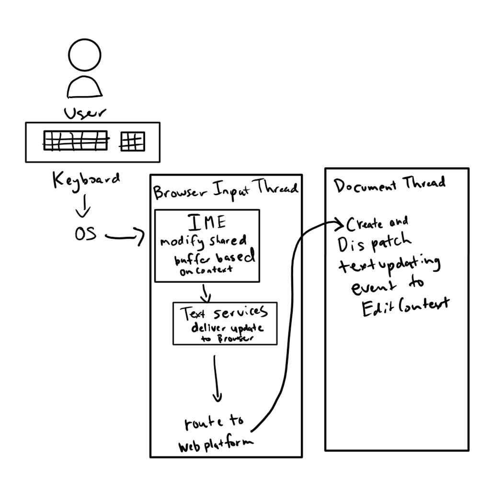

# EditContext API Explained

## Overview

The EditContext API provides a way for web developers to create editing experiences that are integrated with the underlying platform's input modalities (e.g. touch keyboard, IME, shapewriting, etc.) without having to deal with the downsides of contenteditable regions. While contenteditable provides certain desirable functionality, such as caret and IME placement, it is fundamentally a WYSIWYG editor for *HTML* content. When contenteditable regions are used for editing, in order to compute the underlying document model (which is not always HTML) the HTML DOM within the contenteditable region must be scraped and interpreted in order to derive the correct representation. On the other hand, setting up keyboard and composition event handlers on any non-editable Element doesn't provide a fully integrated editing experience.

## Details

The EditContext API is an abstraction over a shared text input buffer that is a plain text model of the content being edited. It also has the notion of selection, expressed as offsets into the buffer (collapsed selection represents an insertion point or caret). The EditContext has a notion of layout bounds of the view of the editable region, as well as the selection. These values are provided by the web developer so that touch keyboards and IME's can be appropriately positioned. Having a shared buffer and selection allows for software keyboards to have context regarding the contents being edited. This enables features such as autocorrection suggestions, composition reconversion, and simplified handling of composition candidate selection.

Because the buffer and selection are stateful, updating the contents of the buffer is a cooperative process between the characters coming from the user and changes to the content that are driven by other events. Cooperation takes place through a series of events dispatched on the EditContext to the web application --- these events are requests from the text services framework for updates to the editable text or the web application's view of that text. The web application is also responsible for communicating state changes to the text input services, by using methods on the EditContext.

The text services framework reads the following state:
* contents
* selection location
* location on the screen

The text services framework can also request that the buffer or view of the application be modified by requesting that:
* the text of the buffer be updated
* the selection of the buffer be relocated
* the text of the buffer be highlighted over a particular range

The web application is free to communicate before, after or during a request from the text services framework that its:
* buffer has changed
* selection has changed
* layout has changed
* type of expected input has changed

After creating an EditContext object, the web application should initialize the text and selection (unless the default of empty is desired) along with the layout bounds of the EditContext's representation in the HTML view by calling ```textChanged()```, ```selectionChanged()```, and ```layoutChanged()```, respectively.

## Text Flow

### Basic


The typical flow of text input begins when the user presses a key on the keyboard. The OS sees the key press and and delivers a message to the browser's input thread. The browser's input thread will route this to the appropriate document thread. If an EditContext has focus, the keydown event will be fired on that EditContext. As part of handling the key down on the input thread, the IME (if in use) will also be fed the key. It may choose to interpret that key differently depending on the input language --- the IME will then inform the text services framework to update the shared buffer. The text service will then tell the browser about this update, which eventually gets routed to the EditContext via the ```textupdating``` event. The user then lifts their finger from the key - the OS again delivers a message to the browser's input thread, and following the previous flow, keyup will be dispatched on the EditContext.

## API Details

The ```textupdate``` event will be fired on the EditContext when user input has resulted in characters being applied to the editable region. The event signals the fact that the software keyboard updated the text (and as such that state is reflected in the shared buffer at the time the event is fired). This can be a single character update, in the case of typical typing scenarios, or multiple-character insertion based on the user changing composition candidates. Even though text updates are the results of the software keyboard modifying the buffer, the creator of the EditContext is ultimately responsible for keeping its underlying model up-to-date with the content that is being edited as well as telling the EditContext about such changes. These could get out of sync, for example, when updates to the editable content come in through other means (the backspace key is a canonical example --- no ```textupdate``` is fired in this case, and the consumer of the EditContext should detect the keydown event and remove characters as appropriate).

Updates to the shared buffer are done via the ```textChanged()``` method on the EditContext. ```textChanged()``` accepts a range (start and end absolute positions over the underlying buffer) and the characters to insert at that range. ```textChanged()``` should be called anytime the editable contents have been updated. However, in general this should be avoided during the firing of ```textupdate``` as it will result in a canceled composition.

The ```selectionupdate``` event is fired when the input method wants a specific region selected, generally in response to an operation like IME reconversion.
```selectionChanged()``` should be called whenever the selection has changed, e.g. from Shift+Arrow or some other combination of control keys.

The ```layoutChanged()``` method must be called whenever the client coordinates of the view of the EditContext have changed. The preferred method of providing that update is through an IntersectionObserver, which will ensure up-to-date coordinates can be reported for each frame. For example, if content is added near the editable content, or the document is scrolled, the coordinates may change without the EditContext being involved. Using an IntersectionObserver will ensure such changes are reported to the text services framework as the editable content moves around on the screen.

The ```textformatupdate``` event is fired when the input method desires a specific region to be styled in a certain fashion, limited to the style properties that correspond with the properties that are exposed on TextFormatUpdateEvent (e.g. backgroundColor, textDecoration, etc.). The consumer of the EditContext should update their view accordingly to provide the user with visual feedback as prescribed by the software keyboard. Note that this may have accessibility implications, as the IME may not be aware of the color scheme of the editable contents (i.e. may be requesting blue highlight on text that was already blue).

```compositionstart``` and ```compositioncompleted``` fire when IME composition begins and ends. It does not provide any other contextual information, as the ```textupdating``` events will let the application know the text that the user wished to insert.

There can be multiple EditContext's per document, and they each have a notion of focused state. Because there is no implicit representation of the EditContext in the HTML view, focus must be managed by the web developer, most likely by forwarding focus calls from the DOM element that contains the editable view. ```focus``` and ```blur``` events are fired on the EditContext in reponse to changes in the focused state.

The ```type``` property on the EditContext denotes what type of input the EditContext is associated with. This information is typically provided to the underlying system as a hint for which software keyboard to load. This defaults to 'text'.

## Example usage

```javascript

// User defined class that contains the underlying model for the editable content
class EditModel {
    constructor(editContext) {
        // This specific model uses the underlying buffer directly so doesn't
        // store model directly.
        this.editContext = editContext;
    }

    updateText(text, updateRange, newSelection) {
        // No action needed, since we're directly using the underlying buffer
        // as our model
    }

    updateSelection(...) {
        // Compute new selection, based on shift/ctrl state
        let newSelection = computeSelection(this.editContext.currentSelection, ...);
        this.editContext.selectionChanged(newSelection.start, newSelection.end);
    }

    insertNewline() {
        this.editContext.textChanged(this.selection.start, this.selection.end, "\\n");
    }

    deleteCharacters(direction) {
        if (this.editContext.currentSelection.start === this.editContext.currentSelection.end) {
            // adjust start/end based on direction and whether we're at the beginning or end
        } else {
            this.editContext.textChanged(this.selection.start, this.selection.end, "");
        }
    }
}

// User defined class that can compute an HTML view, based on the text model
class EditableView {
    constructor(editContext, editRegionElement) {
        this.editContext = editContext;
        this.editRegionElement = editRegionElement;
    }

    queueUpdate() {
        if (!this.updateQueued) {
            requestAnimationFrame(this.renderView.bind(this));
            this.updateQueued = true;
        }
    }

    renderView() {
        this.editRegionElement.innerHTML = convertTextToHTML(
            this.editContext.currentTextBuffer, this.editContext.currentSelection);
        this.updateQueued = false;
    }
}


let editContext = new EditContext();
let model = new EditModel(editContext);
let view = new EditableView(editContext, document.querySelector("#editregion");

editContext.addEventListener("keydown", e => {
    // Handle control keys that don't result in characters being inserted
    switch (e.key) {
        case "ArrowLeft":
        case "Home":
            model.updateSelection(...);
            view.queueUpdate();
            break;
        case "Enter":
            model.insertNewline();
            view.queueUpdate();
            break;
        case "Backspace":
            model.deleteCharacters("back");
            view.queueUpdate();
            break;
        case "Control":
        ...
    }
});

editContext.addEventListener("keyup", e => {
    // Manage key modifier states
    switch (e.key) {
        case "Control":
        case "Shift":
        ...
    }
});

editContext.addEventListener("textupdating", (e => {
    model.updateText(e.text, e.updateRange);

    // Do not call textChanged on editContext, as we're accepting
    // the incoming input.

    view.queueUpdate();
});

editContext.addEventListener("focus", (e => {
    // Update view to reflect the focus state
});

editContext.addEventListener("blur", (e => {
    // Update view to reflect the focus state
});

editContext.focus();
```

## WebIDL

```webidl
interface EditContextTextRange {
    readonly attribute unsigned long start;
    readonly attribute unsigned long end;
};

interface EditEvent : Event {
};

interface TextUpdate : EditEvent {
    readonly attribute EditContextTextRange updateRange;
    readonly attribute USVString updateText;
    readonly attribute EditContextTextRange newSelection;
};

interface SelectionUpdateEvent : EditEvent {
    readonly attribute EditContextTextRange updatedSelectionRange;
};

interface TextFormatUpdateEvent : EditEvent {
    readonly attribute EditContextTextRange formatRange;
    readonly attribute USVString color;
    readonly attribute USVString backgroundColor;
    readonly attribute USVString underlineColor;
    readonly attribute USVString underlineType;
    readonly attribute USVString reason;
};

enum EditContextInputType { "text, "tel", "email" };

/// @event name="keydown", type="KeyboardEvent"
/// @event name="keyup", type="KeyboardEvent"
/// @event name="textupdate", type="TextUpdateEvent"
/// @event name="selectionupdate", type="SelectionUpdateEvent"
/// @event name="textformatupdate", type="TextFormatUpdateEvent"
/// @event name="focus", type="FocusEvent"
/// @event name="blur", type="FocusEvent"
/// @event name="compositionstart", type="CompositionEvent"
/// @event name="compositioncompleted", type="CompositionEvent"
interface EditContext : EventTarget {
    void focus();
    void blur();
    void selectionChanged(unsigned long start, unsigned long end);
    void layoutChanged(DOMRect controlBounds, DOMRect selectionBounds);
    void textChanged(unsigned long start, unsigned long end, USVString updateText);
    
    readonly attribute USVString currentTextBuffer;
    readonly attribute EditContextTextRange currentSelection;

    attribute EditContextInputType type;
};

```

## Open Issues

How to deal with the object model for focus, which is currently expressed via an Element (e.g. document.activeElement). Additionally how do we define tab ordering? Could we associate the EditContext with an element and have it 'forward' events? 

No mention of accessibility --- need integration so that screen readers also have context as to where the caret/selection is placed in the content.
