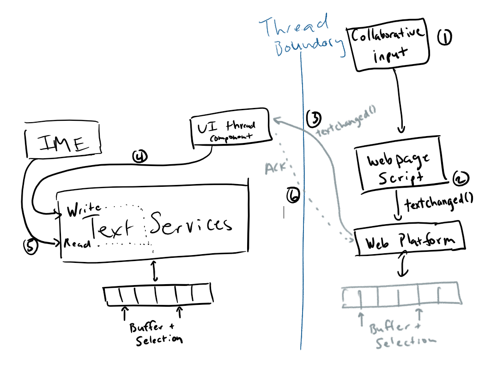

# EditContext API Explained
## Motivation
This document proposes an API that allows web sites to integrate with the input services of the OS, without requiring that an editable element be focused in the DOM.  Without a focused, editable element, a web editing app has no way to enable composition from IMEs and access other advanced input mechanisms like handwriting recognition and shape-writing.

The motivation for such an API is to avoid the pitfalls that editing apps currently experience when using one of two patterns that are prevalent on the web today:

1. A contenteditable element that is part of the editing application's view and contains the content to be edited
1. Using a (mostly) hidden textarea which contains (potentially a subset of) the content to be edited, while displaying a separate view of the document in HTML

The first approach limits the app's ability to enhance the view, as the view (DOM) is the authoritative source on the contents of the document being edited (i.e. the model for the document and the HTML view of that document are the same).

This is a problem for building an app like Visual Studio, which provides a rich view for syntax highlighting and augments methods and classes with commit history and dependency information.  The formatting and extra information shown in the view is not part of the editable document.


When a browser interprets this data as the editable document and fulfills requests for the OS input methods, the discrepancy can negatively affect the authoring experience.

TODO: insert bad suggestion screen shot when using virtual keyboard

An additional issue with using contenteditable is that the editing operations built-in to the browser are designed to edit HTML, which produces results that are unrelated to the change in the actual editable document.  For example, typing an 'x' after public in the document shown above when using a contenteditable element would continue with the preceding blue color making publicx look like a keyword.  To avoid the issue, authors may prevent the default handling of input (e.g. on keydown), but that can only be done when a composition is not in progress, specifically, there is no way to prevent modification of the DOM during composition without disabling composition.

For these reasons, many editing applications opt for an alternative approach using a hidden textarea to capture input, including composition.  A separate HTML view of the document is produced providing flexibility in the presentation of the document that was an issue using the previous contenteditable approach.  

For the hidden textarea approach to work it must be focused and it must contain the browser's native selection.  These constraints come with the following drawbacks:

1. Native selection cannot be used as part of the view, which adds complexity (since the editing app must now build its own representation of selection and the caret), and (unless rebuilt by the editing app) eliminates specialized experiences for touch where selection handles and other affordances can be supplied for a better experience.
TODO: screenshot of issue
1. When the location of selection in the textarea doesn't perfectly match the location of selection in the view, it creates problems when software keyboards attempt to reposition the viewport to where the system thinks editing is occurring.
TODO: screenshot of issue
1. Accessibility is negatively impacted.  Assistive technologies may highlight the textarea and not the view, read only the subset of the content copied into the textarea and not what is visible to the user.
TODO: screenshot or video of the issue

## Details

The EditContext API is an abstraction over a shared text input buffer that is a plain text model of the content being edited. It also has the notion of selection, expressed as offsets into the buffer (collapsed selection represents an insertion point or caret). The EditContext has a notion of layout bounds of the view of the editable region, as well as the selection. These values are provided by the web developer so that touch keyboards and IME's can be appropriately positioned. Having a shared buffer and selection allows for software keyboards to have context regarding the contents being edited. This enables features such as autocorrection suggestions, composition reconversion, and simplified handling of composition candidate selection.

Because the buffer and selection are stateful, updating the contents of the buffer is a cooperative process between the characters coming from the user and changes to the content that are driven by other events. Cooperation takes place through a series of events dispatched on the EditContext to the web application &mdash; these events are requests from the text services framework for updates to the editable text or the web application's view of that text. The web application is also responsible for communicating state changes to the text input services, by using methods on the EditContext.

The text services framework reads the following state:
* contents
* selection location
* location on the screen

The text services framework can also request that the buffer or view of the application be modified by requesting that:
* the text of the buffer be updated
* the selection of the buffer be relocated
* the text of the buffer be highlighted over a particular range

The web application is free to communicate before, after or during a request from the text services framework that its:
* buffer has changed
* selection has changed
* layout has changed
* type of expected input has changed

After creating an EditContext object, the web application should initialize the text and selection (unless the default of empty is desired) along with the layout bounds of the EditContext's representation in the HTML view by calling ```textChanged()```, ```selectionChanged()```, and ```layoutChanged()```, respectively.

## Basic scenarios


The typical flow of text input comes from the user pressing keys on the keyboard. These are delivered to the browser, which opted-in to using the system's text services framework in order to integrate with the IMEs installed on the system. This will cause input to be forwarded to the active IME. The IME is then able to query the text services to read contextual information related to the underlying editable text in order to provide suggestions, and potentially modify which character(s) should be written to the shared buffer. These modifications are typically performed based on the current selection, which is also communicated through the text services framework. When the shared buffer is updated, the web application will be notified of this via the ```textupdate``` event.

Changes to the editable contents can also come from external events, such as collaboration scenarios. In this case, the web editing framework may get some XHR completion that notifies it of some pending collaboartive change that another user has committed. The framework is then responsible for writing to the shared buffer, via the ```textChanged()``` method.


## API Details

The ```textupdate``` event will be fired on the EditContext when user input has resulted in characters being applied to the editable region. The event signals the fact that the software keyboard updated the text (and as such that state is reflected in the shared buffer at the time the event is fired). This can be a single character update, in the case of typical typing scenarios, or multiple-character insertion based on the user changing composition candidates. Even though text updates are the results of the software keyboard modifying the buffer, the creator of the EditContext is ultimately responsible for keeping its underlying model up-to-date with the content that is being edited as well as telling the EditContext about such changes. These could get out of sync, for example, when updates to the editable content come in through other means (the backspace key is a canonical example &mdash; no ```textupdate``` is fired in this case, and the consumer of the EditContext should detect the keydown event and remove characters as appropriate).

Updates to the shared buffer that are not initiated via text services raising a ```textupdate``` event are performed by calling the ```textChanged()``` method on the EditContext. ```textChanged()``` accepts a range (start and end offsets over the underlying buffer) and the characters to insert at that range. ```textChanged()``` should be called anytime the editable contents have been updated. However, in general this should be avoided during the firing of ```textupdate``` as it will result in a canceled composition.

The ```selectionupdate``` event may be fired when the IME wants a specific region selected, generally in response to an operation like IME reconversion.
```selectionChanged()``` should be called whenever the selection has changed. This could be from a combination of control keys (e.g. Shift + Arrow) or mouse selection.

The ```layoutChanged()``` method must be called whenever the client coordinates of the view of the EditContext have changed. The arguments to this method describe a bounding box for both the editable region and also the current selection. 

The ```textformatupdate``` event is fired when the input method desires a specific region to be styled in a certain fashion, limited to the style properties that correspond with the properties that are exposed on TextFormatUpdateEvent (e.g. backgroundColor, textDecoration, etc.). The consumer of the EditContext should update their view accordingly to provide the user with visual feedback as prescribed by the software keyboard. Note that this may have accessibility implications, as the IME may not be aware of the color scheme of the editable contents (i.e. may be requesting blue highlight on text that was already blue).

```compositionstart``` and ```compositioncompleted``` fire when IME composition begins and ends. It does not provide any other contextual information, as the ```textupdate``` events will let the application know the text that the user wished to insert.

There can be multiple EditContext's per document, and they each have a notion of focused state. Because there is no implicit representation of the EditContext in the HTML view, focus must be managed by the web developer, most likely by forwarding focus calls from the DOM element that contains the editable view. ```focus``` and ```blur``` events are fired on the EditContext in reponse to changes in the focused state.

The ```type``` property on the EditContext (also can be passed in a dictionary to the constructor) denotes what type of input the EditContext is associated with. This information is typically provided to the underlying system as a hint for which software keyboard to load (e.g. keyboard for phone numbers may be a numpad instead of the default keyboard). This defaults to 'text'.

## Example usage


Creating an EditContext and have it be focused
```javascript
let editContext = new EditContext({type: "text"});
editContext.focus();
```

Assuming ```model``` represents the document model for the editable content, and ```view``` represents and object that produces an HTML view of the document.
Register for textupdate and keyboard related events:
```javascript
editContext.addEventListener("keydown", e => {
    // Handle control keys that don't result in characters being inserted
    switch (e.key) {
        case "Home":
            model.updateSelection(...);
            view.queueUpdate();
            break;
        case "Backspace":
            model.deleteCharacters("back");
            view.queueUpdate();
            break;
        case "Control":
        ...
    }
});

editContext.addEventListener("keyup", e => {
    // Manage key modifier states
    switch (e.key) {
        case "Control":
        case "Shift":
        ...
    }
});

editContext.addEventListener("textupdate", (e => {
    model.updateText(e.text, e.updateRange);

    // Do not call textChanged on editContext, as we're accepting
    // the incoming input.

    view.queueUpdate();
});
```

Example of a user-defined EditModel class that contains the underlying model for the editable content
```javascript
// User defined class 
class EditModel {
    constructor(editContext) {
        // This specific model uses the underlying buffer directly so doesn't
        // store model directly.
        this.editContext = editContext;
    }

    updateText(text, updateRange, newSelection) {
        // No action needed, since we're directly using the shared buffer
        // as our model
    }

    updateSelection(...) {
        // Compute new selection, based on shift/ctrl state
        let newSelection = computeSelection(this.editContext.currentSelection, ...);
        this.editContext.selectionChanged(newSelection.start, newSelection.end);
    }

    insertNewline() {
        this.editContext.textChanged(this.selection.start, this.selection.end, "\\n");
    }

    deleteCharacters(direction) {
        if (this.editContext.currentSelection.start === this.editContext.currentSelection.end) {
            // adjust start/end based on direction and whether we're at the beginning or end
        } else {
            this.editContext.textChanged(this.selection.start, this.selection.end, "");
        }
    }
}
```

Example of a user defined class that can compute an HTML view, based on the text model
```javascript
class EditableView {
    constructor(editContext, editRegionElement) {
        this.editContext = editContext;
        this.editRegionElement = editRegionElement;
    }

    queueUpdate() {
        if (!this.updateQueued) {
            requestAnimationFrame(this.renderView.bind(this));
            this.updateQueued = true;
        }
    }

    renderView() {
        this.editRegionElement.innerHTML = convertTextToHTML(
            this.editContext.currentTextBuffer, this.editContext.currentSelection);

        this.editContext.layoutChanged(this.computeBoundingBox(), this.computeSelectionBoundingBox());

        this.updateQueued = false;
    }
}
```

## Implementation notes

In a browser where the document thread is separate from the input thread, there is some synchronization that needs to take place so that the web developer can provide a consistent and reliable editing experience to the user. Because the threads are decoupled, there must be another copy of the shared buffer to avoid synchronous communication between the two threads. The copies of the shared buffer are then managed by a component that lives on the input thread, and a component that lives in the web platform component. The copies can then be synchronized by converting updates to asynchronous notifications with ACKs, where the updates are not committed until it has been confirmed as received by the other thread.

As in the previous section the basic flow of input in this model could look like this:



### Resolving conflicts

It is possible for conflicts to occur between the input thread and script thread updating the shared buffer. These can be resolved in such a way that the users input is not dropped and is consistently applied in the expected manner.

Let's say there is an EditContext that starts with a shared buffer of ```"abc|"``` with the selection/caret being at the end of the buffer. The user types ```d``` and approximately the same time, there is a collaborative update to the document that prepends ```x``` &mdash; these are delivered independently to each thread.
1. The input thread sees the insertion of ```d``` at position 3, the shared buffer is updated to ```"abcd|```, and the input thread component keeps a record of this pending action. It then sends a textupdate notification to the document thread. 
2. Meanwhile, prior to receiving that notification, the document thread processes the prepending of ```x``` and sends a notification to the input thread of this text change, keeping track of this pending operation. 
3. The input thread receives the text change notification prior to the ACK for its pending textupdate. To resolve this conflict, it undoes the pending insertion of ```d``` and applies the text change. It is then determined that the previous insertion location of ```d``` was not modified* by the text change, so it replays the insertion of ```d```, but at position 4 instead and keeps this as a pending update. This leaves the shared buffer as ```"xabcd|"```. The ACK of the text change is sent to the document thread.
4. The document thread then yields and receives the text update of ```d``` at position 3. It determines that it has a pending operation outstanding, so runs through the same algorithm as the input thread &mdash; the ```x``` is already prepended but the text update is determined to not have been modified by the pending operations. The text update is then adjusted and applied as ```d``` at position 4. The text update is then ACK'd back to the input thread.
5. The ACK of the text change is received on the document thread and the pending operation is removed (committed)
6. The ACK of the text update is received on the input thread and its pending operation is also removed (committed)

\* An operation is only affected by a change if the range on which it was originally intended to apply to has been modified.


The layout position of the EditContext is also reported to the input thread component, which caches the values and lets the text services know that the position has changed. In turn, it uses the cached values to respond to any read requests from the text services.

## Open Issues

How to deal with the object model for focus, which is currently expressed via an Element (e.g. document.activeElement). Additionally how do we define tab ordering? Could we associate the EditContext with an element and have it 'forward' events? 

How does EditContext integrate with accessibility [Accessibility Object Model?](http://wicg.github.io/aom/explainer.html) so that screen readers also have context as to where the caret/selection is placed as well as the surrounding contents.

We need a mechanism by which ```layoutChanged()``` is more easily integrated. If we wanted something limited to an HTML view, we could have the web author register two Ranges over which we'll compute the bounding box on their behalf, propagating changes as they are encountered. However, not all consumers will have an HTML view (i.e. what if the view is a canvas). In that case, we may need to provide a callback during the rendering steps where the EditContext owner can set the updated layout bounds themselves.
