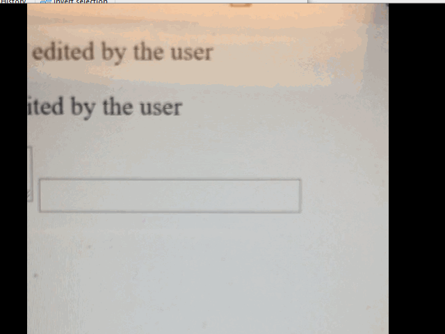

# EditContext API Explained
## Intro needs further editing to capture the following
Editing on the web has evolved from filling in forms -

Editing on the web has slowly evolved from users needing to fill out forms into web authors wanting to proivde their own view of  what the rich text editor should do. With that came more advanced scenarios that existing CE and other input types could not accomodate.

As it currently stands, editing frameworks do not agree with existing machinery of UA generated content and the amount of DOM mutations that happen during user input. They want to understand the intention of the user early in the input stack and they want to be able to override or prevent all together browser's default behavior

Rich editing experiences are not necessarily editing HTML, HTML is used to construct a view of some app-specific document model -

The problems come from the legacy design that were implemented to accomodate much of editing on the web almsot two decades ago. The root of the problem is the  tight coupling between user input and DOM and Layout operations which stems from a fundamental characteristic of HTML semantics that ties data model and view together. In addition, the complicated input machinery doesn’t explain what is about to be inserted into markup and how. These constraints bound developers to rewrite major parts of browser behavior at a high cost. In addition, it ties the developers to use HTML as their document model which may not be what they want.

The two most prevelant appoaches on the web in building a rich text editors are using of
1. A contenteditable element that is part of the editing application's view and contains the content to be edited
1. Using a (mostly) hidden textarea which contains (potentially a subset of) the content to be edited, while displaying a separate view of the document in HTML

The first approach limits the 
app's ability to enhance the view, as the view (i.e. the DOM) is also the authoritative source on the contents of the document being edited (i.e. the model for the document and the HTML view of that document are the same).

This is a problem for building an app like Visual Studio, which provides a rich view for syntax highlighting and augments methods and classes with commit history and dependency information.  The formatting and extra information shown in the view is not part of the editable document. This may cause for the caret to be placed in places it should not go.


When a browser interprets this data as the editable document and fulfills requests for the OS input methods, the discrepancy can negatively affect the authoring experience.

TODO: insert bad suggestion screen shot when using virtual keyboard

An additional issue with using contenteditable is that the editing operations built-in to the browser are designed to edit HTML, which produces results that are unrelated to the change in the actual editable document.  For example, typing an 'x' after public in the document shown above when using a contenteditable element would continue with the preceding blue color making "publicx" look like a keyword.  To avoid the issue, authors may prevent the default handling of input (e.g. on keydown). This can be done but only for regular keyboard input and when a composition is not in progress, specifically, there is no way to prevent modification of the DOM during composition without disabling composition.

For these reasons, many editing applications opt-in for an alternative approach using a hidden textarea to capture input, including composition. The hidden textarea allows the app to decouple its view of the document from the data the browser will interpret as being editable. This provides flexibility in the presentation of the document and works around issues with the previous contenteditable approach.

However, for the hidden textarea approach to work, it must be focused and it must contain the browser's native selection. These constraints come with the following drawbacks:

1. Native selection cannot be used as part of the view (because its being used in the hidden textarea instead), which adds complexity (since the editing app must now build its own representation of selection and the caret), and (unless rebuilt by the editing app) eliminates specialized experiences for touch where selection handles and other affordances can be supplied for a better experience. Here are two examples of missing selection grippers functionality.


todo: add the gif sith grippers in it
1. When the location of selection in the textarea doesn't perfectly match the location of selection in the view, it creates problems when software keyboards attempt to reposition the viewport to where the system thinks editing is occurring.
TODO: screenshot of issue
1. Accessibility is negatively impacted. Assistive technologies may highlight the textarea and not the view and read only the subset of the content copied into the textarea and not what is visible to the user.
Here, although you would not be able to hear, when in Scan mode, Narrator is reading the text in the hidden text area which is the comments above the caret, even though, visually, the caret is drawn in a different location.


### Existing Proposals:
Multiple approaches have been discussed during the meetings and through online discussions. The group has [considered](https://w3c.github.io/editing/contentEditable.html) adding new attribute values to contenteditable (events, caret, typing) that in would allow web authors to prevent certain input types or to modify some input before it has made it into the markup. This approach hasn’t gotten much traction since browsers would still be building these behaviors on top of content editable thus, inheriting existing limitations.
 
Another approach taken was to introduce “beforeInput” event. While sounding great in concept, It eventually diverged into two different specs, [Level 1](https://www.w3.org/TR/input-events-1/) (Blink implementation) and [Level 2](https://www.w3.org/TR/input-events-2/) (Webkit implementation). The idea behind this event was to allow developer to preventDefault user input (except for IME cases) and provide information about the type of the input. Due to Android IME constraints, Blink made most of the beforeInput event types non-cancelable except for a few formatting input types. This divergence would only get worse over time and since it only solves a small subset of problems for the web, it can’t be considered as a long-term solution.

As an alternative to the failed beforeInput Google has proposed a roadmap in [Google Chrome Roadmap Proposal](https://docs.google.com/document/d/10qltJUVg1-Rlnbjc6RH8WnngpJptMEj-tyrvIZBPSfY/edit) where it was proposed to use existing browser primitives solving CE problems with textarea buffer approach, similar to what developers have already been doing. While we agree with it in concept, we don't think there is a clean way to solve this with existing primitives. Hence, we are proposing EditContext API.

These API's are inspired by Lower-level APIs provided by modern operating systems
  * To facilitate input using a variety of modalities, iOS, Android, Windows, and others? have developed a stateful intermediary that sits between input clients (e.g. IMEs) and input consumers (i.e. an editing app).
  * This intermediary facilitates communication using an array-like, plain-text view of its document, and allows various input clients to:
    * Query for the text of that view, for example, to increase the accuracy of suggestions while typing
    * Request that regions of the document be highlighted, for example, to facilitate composition
    * It also can request the location of text in the view, for example, to display input-client specific UI can be displayed in an appropriate location.
  * Browsers take advantage of these OS input services whenever an editable element is focused by registering for callbacks to handle the requests for location, highlighting and text updating.

This document proposes similar in concept EditContext API that provides a way for web developers to create editing experiences that are integrated with the underlying platform's input modalities (e.g. touch keyboard, IME, shapewriting, etc.) without having to deal with the downsides of contenteditable regions. While contenteditable provides certain desirable functionality, such as caret and IME placement, it is fundamentally a WYSIWYG editor for *HTML* content. When contenteditable regions are used for editing, in order to compute the underlying document model (which is not always HTML) the HTML DOM structure within the contenteditable region must be read and interpreted, in order to derive the desired representation document being edited. On the other hand, setting up keyboard and composition event handlers on any non-editable Element doesn't provide a fully integrated editing experience.


## Details

The EditContext API is an abstraction over a shared text input buffer that is a plain text model of the content being edited. Creating an edit context conceptually tells the user agent to instantiate the appropriate machinery to create a target for text input operations, without creating an contenteditable portion of the DOM tree. The EditContext also has the notion of selection, expressed as offsets into the buffer (collapsed selection represents an insertion point or caret). The EditContext keeps state to describe the layout bounds of the view of the editable region, as well as the bounds of the selection. These values are provided by the web developer, and communicated by the user agent to the underlying platform so that touch keyboards and IME's can be appropriately positioned.

Having a shared buffer and selection allows for software keyboards to have context regarding the contents being edited. This enables features such as autocorrection suggestions, composition reconversion, and simplified handling of composition candidate selection. Because the buffer and selection are stateful, updating the contents of the buffer is a cooperative process between the characters coming from user input and changes to the content that are driven by other events. Cooperation takes place through a series of events dispatched on the EditContext to the web application &mdash; these events are requests from the text services framework for updates to the editable text or the web application's view of that text. The web application is also responsible for communicating state changes to the text input services, by using methods on the EditContext.

The EditContext must be focused in order to receive updates from the systems text services. This does not change or modify the existing focused/active element, but instead instructs the user agent that a given EditContext is active and thus text editing related updates should be delivered via events on the EditContext.

While an EditContext is active, the text services framework reads the following state:
* contents
* selection location
* location on the screen

The text services framework can also request that the buffer or view of the application be modified by requesting that:
* the text of the buffer be updated
* the selection of the buffer be relocated
* the text of the buffer be highlighted over a particular range

The web application is free to communicate before, after or during a request from the text services framework that its:
* buffer has changed
* selection has changed
* layout has changed
* type of expected input has changed

### Code example

Create an EditContext and have it start receiving events when its associated container gets focus. After creating an EditContext object, the web application should initialize the text and selection (unless the default of empty is desired) via a dictionary passed to the constructor, along with the layout bounds of the EditContext's representation in the HTML view by calling ```layoutChanged()```.

```javascript
let editContainer = document.querySelector("#editContainer");
let editContext = new EditContext({
    type: "text",
    initialText: "Hello world",
    initialSelection: { start: 11, end: 11 }
});

editContainer.addEventListener("focus", () => editContext.focus());
window.requestAnimationFrame(() => {
    editContext.layoutChanged(editContainer.getBoundingClientRect(), computeSelectionBoundingRect());
});

editContainer.focus();
```

Assuming ```model``` represents the document model for the editable content, and ```view``` represents and object that produces an HTML view of the document (see [Code Appendix](#code-appendix) for more details on example implementations), register for textupdate and keyboard related events (note that keydown/keyup are still delivered to the edit container that still has focus):

```javascript
editContainer.addEventListener("keydown", e => {
    // Handle control keys that don't result in characters being inserted
    switch (e.key) {
        case "Home":
            model.updateSelection(...);
            view.queueUpdate();
            break;
        case "Backspace":
            model.deleteCharacters(Direction.BACK);
            view.queueUpdate();
            break;
        case "Control":
        ...
    }
});

editContainer.addEventListener("keyup", e => {
    // Manage key modifier states
    switch (e.key) {
        case "Control":
        case "Shift":
        ...
    }
});

editContext.addEventListener("textupdate", (e => {
    model.updateText(e.newText, e.updateRange);

    // Do not call textChanged on editContext, as we're accepting
    // the incoming input.

    view.queueUpdate();
});
```

## Basic scenarios


The typical flow of text input comes from the user pressing keys on the keyboard. These are delivered to the browser, which opted-in to using the system's text services framework in order to integrate with the IMEs installed on the system. This will cause input to be forwarded to the active IME. The IME is then able to query the text services to read contextual information related to the underlying editable text in order to provide suggestions, and potentially modify which character(s) should be written to the shared buffer. These modifications are typically performed based on the current selection, which is also communicated through the text services framework. When the shared buffer is updated, the web application will be notified of this via the ```textupdate``` event.

When an EditContext has focus, this sequence of events is fired when a key is pressed and an IME is not active:

|  Event        | EventTarget        |
| ------------- | ------------------ |
|  keydown      | focused element    |
|  textupdate   | active EditContext |
|  keyup        | focused element    |

Note that keypress is not delivered, as the active EditContext instead receives the textupdate event.

Now consider the scenario where an IME is active, the user types in two characters, then commits to the first IME candidate by hitting 'Space'.

|  Event                | EventTarget        |  Related key in sequence
| -------------         | -----------------  | -------------------
|  keydown              | focused element    |  Key 1
|  compositionstart     | active EditContext |  ...
|  textupdate           | active EditContext |  ...
|  keyup                | focused element    |  ...
|  keydown              | focused element    |  Key 2
|  textupdate           | active EditContext |  ...
|  keyup                | focused element    |  ...
|  keydown              | focused element    |  Space
|  textupdate           | active EditContext |  (committed IME characters available in event.updateText)
|  keyup                | focused element    |  ...
|  compositioncomplete  | active EditContext |

Note that the composition events are also not fired on the focused element as the composition is operating on the shared buffer that is represented by the EditContext.

Changes to the editable contents can also come from external events, such as collaboration scenarios. In this case, the web editing framework may get some XHR completion that notifies it of some pending collaboartive change that another user has committed. The framework is then responsible for writing to the shared buffer, via the ```textChanged()``` method.


## API Details

The ```textupdate``` event will be fired on the EditContext when user input has resulted in characters being applied to the editable region. The event signals the fact that the software keyboard or IME updated the text (and as such that state is reflected in the shared buffer at the time the event is fired). This can be a single character update, in the case of typical typing scenarios, or multiple-character insertion based on the user changing composition candidates. Even though text updates are the results of the software keyboard modifying the buffer, the creator of the EditContext is ultimately responsible for keeping its underlying model up-to-date with the content that is being edited as well as telling the EditContext about such changes. These could get out of sync, for example, when updates to the editable content come in through other means (the backspace key is a canonical example &mdash; no ```textupdate``` is fired in this case, and the consumer of the EditContext should detect the keydown event and remove characters as appropriate).

Updates to the shared buffer driven by the webpage/javascript are performed by calling the ```textChanged()``` method on the EditContext. ```textChanged()``` accepts a range (start and end offsets over the underlying buffer) and the characters to insert at that range. ```textChanged()``` should be called anytime the editable contents have been updated. However, in general this should be avoided during the firing of ```textupdate``` as it will result in a canceled composition.

The ```selectionupdate``` event may be fired when the IME wants a specific region selected, generally in response to an operation like IME reconversion.
```selectionChanged()``` takes a start and end offset that are communicated whenever the selection has changed. This could be from a combination of control keys (e.g. Shift + Arrow) or mouse selection.

The ```layoutChanged()``` method must be called whenever the client coordinates of the view of the EditContext have changed. This includes if the viewport is scrolled or the position of the editable contents changes in response to other updates to the view. The arguments to this method describe a bounding box in client coordinates for both the editable region and also the current selection. 

The ```textformatupdate``` event is fired when the input method desires a specific region to be styled in a certain fashion, limited to the style properties that correspond with the properties that are exposed on TextFormatUpdateEvent (e.g. backgroundColor, textDecoration, etc.). The consumer of the EditContext should update their view accordingly to provide the user with visual feedback as prescribed by the software keyboard. Note that this may have accessibility implications, as the IME may not be aware of the color scheme of the editable contents (i.e. may be requesting blue highlight on text that was already blue).

```compositionstart``` and ```compositioncompleted``` fire when IME composition begins and ends. It does not provide any other contextual information, as the ```textupdate``` events will let the application know the text that the user chose to insert.

There can be multiple EditContext's per document, and they each have a notion of focused state. Because there is no implicit representation of the EditContext in the HTML view, focus must be managed by the web developer, most likely by forwarding focus calls from the DOM element that contains the editable view. ```focus``` and ```blur``` events are fired on the EditContext in reponse to changes in the focused state. EditContext focus is bound to the element that was focused when the EditContext became active, that is, if the focused element changes, the EditContext will also lose focus.

The ```type``` property on the EditContext (also can be passed in a dictionary to the constructor) denotes what type of input the EditContext is associated with. This information is typically provided to the underlying system as a hint for which software keyboard to load (e.g. keyboard for phone numbers may be a numpad instead of the default keyboard). This defaults to 'text'.

## Implementation notes

In a browser where the document thread is separate from the input thread, there is some synchronization that needs to take place so that the web developer can provide a consistent and reliable editing experience to the user. Because the threads are decoupled, there must be another copy of the shared buffer to avoid synchronous communication between the two threads. The copies of the shared buffer are then managed by a component that lives on the input thread, and a component that lives in the web platform component. The copies can then be synchronized by converting updates to asynchronous notifications with ACKs, where the updates are not committed until it has been confirmed as received by the other thread.

As in the previous section the basic flow of input in this model could look like this:


### Resolving conflicts

It is possible for conflicts to occur between the input thread and script thread updating the shared buffer. These can be resolved in such a way that the users input is not dropped and is consistently applied in the expected manner.

Let's say there is an EditContext that starts with a shared buffer of ```"abc|"``` with the selection/caret being at the end of the buffer. The user types ```d``` and approximately the same time, there is a collaborative update (perhaps triggered/detected by a completed XHR) to the document that prepends ```x``` &mdash; these are delivered independently to each thread.
1. The input thread sees the insertion of ```d``` at position 3, the shared buffer is updated to ```"abcd|```, and the input thread component keeps a record of this pending action. It then sends a textupdate notification to the document thread. 
2. Meanwhile, prior to receiving that notification, the document thread processes the prepending of ```x``` and sends a notification to the input thread of this text change, keeping track of the fact that it too has a pending operation. 
3. The input thread receives the text change notification prior to the ACK for its pending textupdate. To resolve this conflict, it undoes the pending insertion of ```d``` and applies the text change. It is then determined that the previous insertion location of ```d``` was not modified* by the text change, so it replays the insertion of ```d```, but at position 4 instead and keeps this as a pending update. This leaves the shared buffer as ```"xabcd|"```. The ACK of the text change is sent to the document thread.
4. The document thread then yields and receives the text update of ```d``` at position 3. It determines that it has a pending operation outstanding, so runs through the same algorithm as the input thread &mdash; the ```x``` is already prepended but the text update is determined to not have been modified by the pending operations. The text update is then adjusted and applied as ```d``` at position 4. The text update is then ACK'd back to the input thread.
5. The ACK of the text change is received on the document thread and the pending operation is removed (committed)
6. The ACK of the text update is received on the input thread and its pending operation is also removed (committed)

\* An operation is only affected by a change if the range on which it was originally intended to apply to has been modified.


The layout position of the EditContext is also reported to the input thread component, which caches the values and lets the text services know that the position has changed. In turn, it uses the cached values to respond to any read requests from the text services.

## Code Appendix

Example of a user-defined EditModel class that contains the underlying model for the editable content
```javascript
// User defined class 
class EditModel {
    constructor(editContext) {
        // This specific model uses the underlying buffer directly so doesn't
        // store model directly.
        this.editContext = editContext;
    }

    updateText(text, updateRange, newSelection) {
        // No action needed, since we're directly using the shared buffer
        // as our model
    }

    updateSelection(...) {
        // Compute new selection, based on shift/ctrl state
        let newSelection = computeSelection(this.editContext.currentSelection, ...);
        this.editContext.selectionChanged(newSelection.start, newSelection.end);
    }

    insertNewline() {
        this.editContext.textChanged(this.selection.start, this.selection.end, "\\n");
    }

    deleteCharacters(direction) {
        if (this.editContext.currentSelection.start === this.editContext.currentSelection.end) {
            // adjust start/end based on direction and whether we're at the beginning or end
            this.editContext.selectionChanged(...);
        } else {
            // removes characters within selection
            let selectionStart = this.editContext.currentSelection.start;
            this.editContext.textChanged(selectionStart,
                this.editContext.currentSelection.end, "");
            this.editContext.selectionChanged(selectionStart, selectionStart);
        }
    }
}
```

Example of a user defined class that can compute an HTML view, based on the text model
```javascript
class EditableView {
    constructor(editContext, editRegionElement) {
        this.editContext = editContext;
        this.editRegionElement = editRegionElement;

        // When the webpage scrolls, the layout position of the editable view
        // may change - we must tell the EditContext about this.
        window.addEventListener("scroll", this.notifyLayoutChanged.bind(this));

        // Same response is needed when the window is resized.
        window.addEventListener("resize", this.notifyLayoutChanged.bind(this));
    }

    queueUpdate() {
        if (!this.updateQueued) {
            requestAnimationFrame(this.renderView.bind(this));
            this.updateQueued = true;
        }
    }

    renderView() {
        this.editRegionElement.innerHTML = convertTextToHTML(
            this.editContext.currentTextBuffer, this.editContext.currentSelection);

        notifyLayoutChanged();

        this.updateQueued = false;
    }

    notifyLayoutChanged() {
        this.editContext.layoutChanged(this.computeBoundingBox(), this.computeSelectionBoundingBox());
    }
}
```
## Open Issues

How to deal EditContext focus when the focused element itself is editable? In the current proposed model, the focused element doesn't receive things like composition events &mdash; should an editable element receive these? It feels like we should treat these the same as when the text input operations are redirected and not deliver those events to the editable element.

How does EditContext integrate with accessibility [Accessibility Object Model?](http://wicg.github.io/aom/explainer.html) so that screen readers also have context as to where the caret/selection is placed as well as the surrounding contents. This is another major complaint about implementing editors today - without a contenteditable with a full fidelity view, the default accessibility implementations report incorrect information.

It feels like we may need a mechanism by which ```layoutChanged()``` is more easily integrated. Currently there is no single point that the web developer knows it may need to report updated bounds, and the current model may encourage layout thrashing by computing bounds early in the process of producing a frame. Instead we may need to provide a callback during the rendering steps where the EditContext owner can set the updated layout bounds themselves. Perhaps IntersectionObservers is a good model where we can queue a microtask that will fire after the frame has been committed and layout has been computed &mdash; the layout update may be delayed by a frame, but the update is asynchronous anyways.
