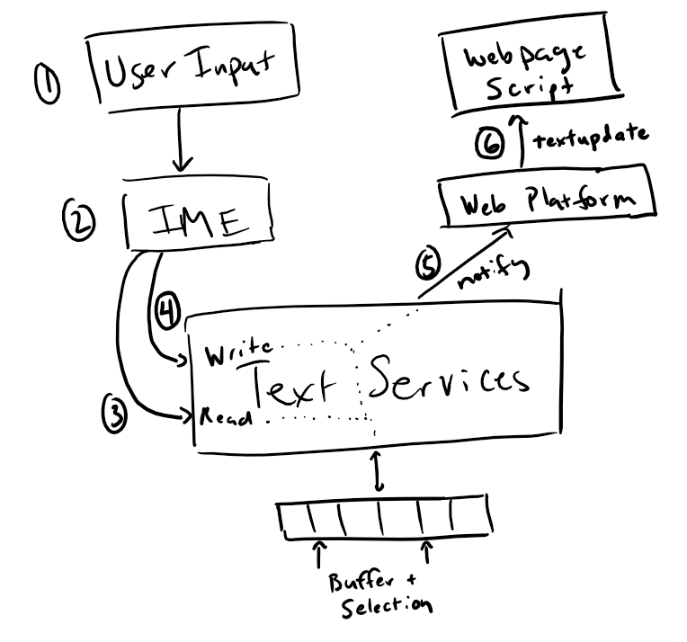
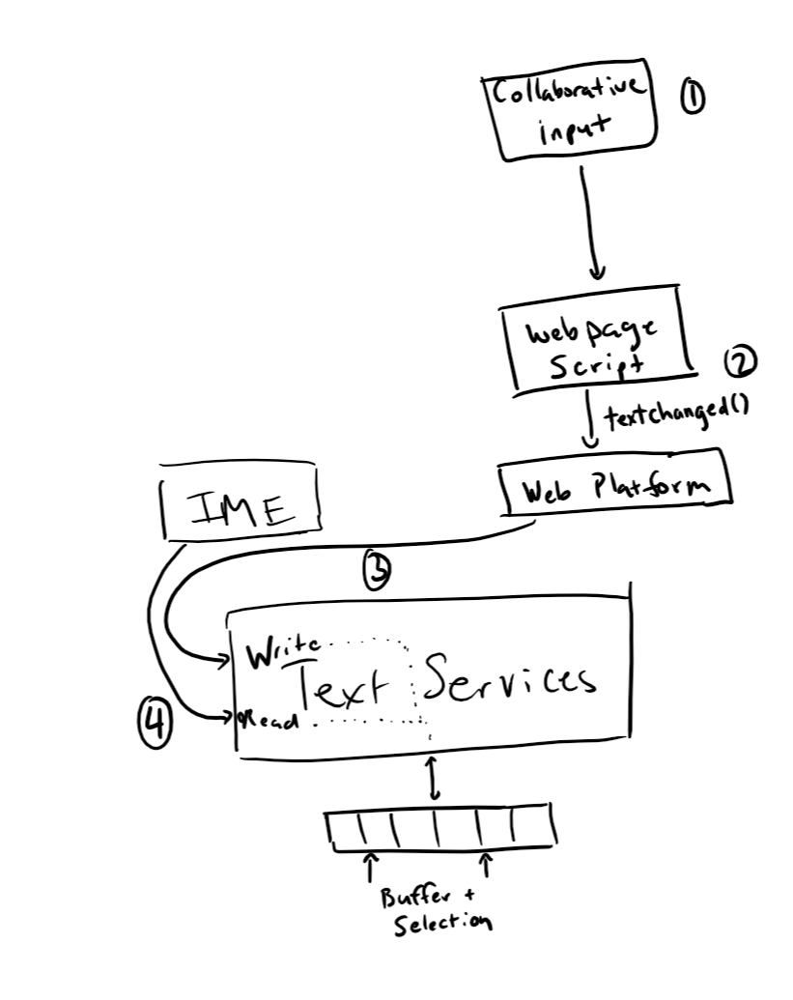
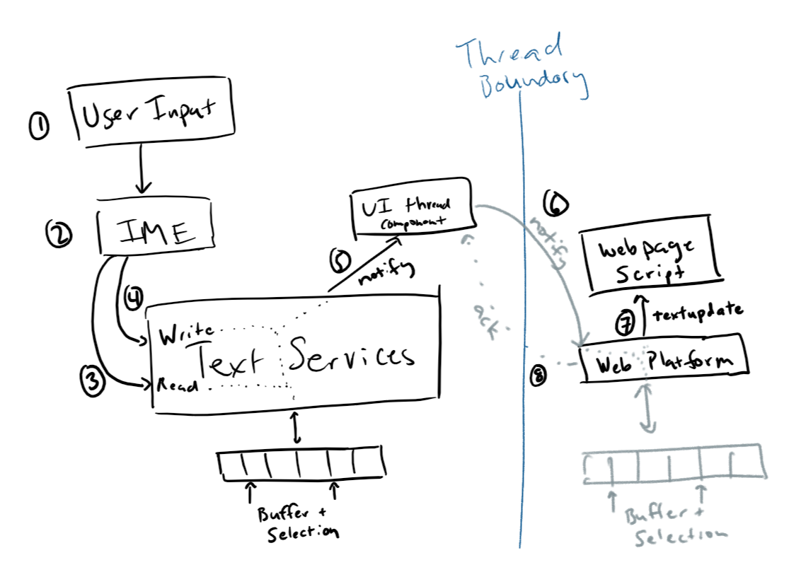

# EditContext API Explained

## Overview

The EditContext API provides a way for web developers to create editing experiences that are integrated with the underlying platform's input modalities (e.g. touch keyboard, IME, shapewriting, etc.) without having to deal with the downsides of contenteditable regions. While contenteditable provides certain desirable functionality, such as caret and IME placement, it is fundamentally a WYSIWYG editor for *HTML* content. When contenteditable regions are used for editing, in order to compute the underlying document model (which is not always HTML) the HTML DOM structure within the contenteditable region must be read and interpreted, in order to derive the desired representation document being edited. On the other hand, setting up keyboard and composition event handlers on any non-editable Element doesn't provide a fully integrated editing experience.

## Motivation

Interoperability in Content Editable (CE from here on) has been the culprit in the world of JavaScript powered editors and one of the main contributors to bugs, performance and redundant code being written. There were numerous articles have been written on the web on this issue. Here are couple of links if you like to get the details.
* [ContentEditable — The Good, the Bad and the Ugl](https://medium.com/content-uneditable/contenteditable-the-good-the-bad-and-the-ugly-261a38555e9c)
* [ Fixing ContentEditable](https://medium.com/content-uneditable/fixing-contenteditable-1a9a5073c35d)

Current problems come from the legacy designs that were implemented to accomodate much of editing on the web almsot two decades ago. The main theme in implementations is the tight coupling between user input and DOM and Layout operations. In addition, the complicated input machinery doesn’t explain what is about to be inserted into markup and how. This approach works for as long as it is a simple input that doesn't need to be modified in any way by a developer which is obviously not the case today.

As it currently stands, editing frameworks do not agree with existing machinery of UA generated content and the amount of DOM mutations that happen during user input. They want to understand the intention of the user and they want to be able to override or prevnet all together browser's default behavior.

 Developers have to deal with side effects of UA generated content in the most basic of editing operations such as formatting commands or special keys such as ENTER, DELETE and BACKSPACE.

 Consider an example that was called out in one of the discussions is the generation of by CKEditor folks where the expectation is UA should generate, ```<strong></strong>``` instead of ```<b></b>``` when CTRL+B is pressed or its equivalent. Whether one agrees with this notion or not, it is fair to provide the developer with a way to implement their own vision. For illustration purposes, take a look at snippet below to see how this could be implemented.
```html
<html>
<body>
    <div id="editableContainer" contenteditable="true"><br/></div>
    <input type="button" onclick="boldSelectedText();" value="Bold" />
    <script>
        let MutationObserver = window.MutationObserver;
        let targetNode = document.getElementById('editableContainer');
        let config = { childList: true };
        let observer = new MutationObserver(function (mutationsList) {
            for (let mutation of mutationsList) {
                if (mutation.type === 'childList') {
                    if (mutation.addedNodes.length > 0) {
                        for (let i = 0; i < mutation.addedNodes.length; i++) {
                            if (mutation.addedNodes[i].tagName === 'B') {
                                let newNode = document.createElement("strong");
                                newNode.innerText = mutation.addedNodes[i].outerText;
                                targetNode.removeChild(mutation.addedNodes[i]);
                                targetNode.appendChild(newNode);
                            }
                        }
                    }
                }
            }
        });
        observer.observe(targetNode, config);
        function boldSelectedText() {
            document.execCommand("bold");
        }
    </script>
</body>
</html>
```

Another example is disagreement on what UA should actuallu generate on ENTER, or delete commands. In case of ENTER, a developer ends up having this after placing caret after "a":
```html
<div contenteditbale="true">
a
    <div>
        <br/>
    </div>
</div>
```
This may not suite their needs as so to change the markup they would have to either implement Mutation Observers, or have special keys such as ENTER implemented in JavaScript and also maintain their own DOM that has to be synchronized with the real one to just get the folloing markup.
```html
<div contenteditbale="true">
a
    <p>
    </p>
</div>
```
As one can see, this is very inefficient and brings a number of issues with it but these are the types of things one must do today to achieve the result. Each solution, be it Mutation observer way or a implement everything on your own, each brings its own set of unique challenges.

Another set of issues that deservers its own section is motivation is IMEs.

There is a great desire from editing frameworks to be able to handle IME input. Today,this is not possible without first waiting for IME compisition to complete then going and undoing SOM changes done by the UA. In other cases, such as controlling candidate window, it is not possible at all.

Rich-text editors want to control the generation of the content end-to-end. Moreover, splitting the view and data model seems to be the common approach in designing the editor in JavaScript.


There are basically a few things that every editor developer wants to do. Control the selection, undo manager, clipboard operations, navigation keys, and regulat typing. Today, this is done after the DOM mutations which as it was mentioned before, can be in the hundreds. The problem only gets worse when developers are forced to write redundant code to account for different behavior in different browsers.


## Details

The EditContext API is an abstraction over a shared text input buffer that is a plain text model of the content being edited. Creating an edit context conceptually tells the user agent to instantiate the appropriate machinery to create a target for text input operations, without creating an contenteditable portion of the DOM tree. The EditContext also has the notion of selection, expressed as offsets into the buffer (collapsed selection represents an insertion point or caret). The EditContext keeps state to describe the layout bounds of the view of the editable region, as well as the bounds of the selection. These values are provided by the web developer, and communicated by the user agent to the underlying platform so that touch keyboards and IME's can be appropriately positioned.

Having a shared buffer and selection allows for software keyboards to have context regarding the contents being edited. This enables features such as autocorrection suggestions, composition reconversion, and simplified handling of composition candidate selection. Because the buffer and selection are stateful, updating the contents of the buffer is a cooperative process between the characters coming from user input and changes to the content that are driven by other events. Cooperation takes place through a series of events dispatched on the EditContext to the web application &mdash; these events are requests from the text services framework for updates to the editable text or the web application's view of that text. The web application is also responsible for communicating state changes to the text input services, by using methods on the EditContext.

The EditContext must be focused in order to receive updates from the systems text services. This does not change or modify the existing focused/active element, but instead instructs the user agent that a given EditContext is active and thus text editing related updates should be delivered via events on the EditContext.

While an EditContext is active, the text services framework reads the following state:
* contents
* selection location
* location on the screen

The text services framework can also request that the buffer or view of the application be modified by requesting that:
* the text of the buffer be updated
* the selection of the buffer be relocated
* the text of the buffer be highlighted over a particular range

The web application is free to communicate before, after or during a request from the text services framework that its:
* buffer has changed
* selection has changed
* layout has changed
* type of expected input has changed

### Code example

Create an EditContext and have it start receiving events when its associated container gets focus. After creating an EditContext object, the web application should initialize the text and selection (unless the default of empty is desired) via a dictionary passed to the constructor, along with the layout bounds of the EditContext's representation in the HTML view by calling ```layoutChanged()```.

```javascript
let editContainer = document.querySelector("#editContainer");
let editContext = new EditContext({
    type: "text",
    initialText: "Hello world",
    initialSelection: { start: 11, end: 11 }
});

editContainer.addEventListener("focus", () => editContext.focus());
window.requestAnimationFrame(() => {
    editContext.layoutChanged(editContainer.getBoundingClientRect(), computeSelectionBoundingRect());
});

editContainer.focus();
```

Assuming ```model``` represents the document model for the editable content, and ```view``` represents and object that produces an HTML view of the document (see [Code Appendix](#code-appendix) for more details on example implementations), register for textupdate and keyboard related events (note that keydown/keyup are still delivered to the edit container that still has focus):

```javascript
editContainer.addEventListener("keydown", e => {
    // Handle control keys that don't result in characters being inserted
    switch (e.key) {
        case "Home":
            model.updateSelection(...);
            view.queueUpdate();
            break;
        case "Backspace":
            model.deleteCharacters(Direction.BACK);
            view.queueUpdate();
            break;
        case "Control":
        ...
    }
});

editContainer.addEventListener("keyup", e => {
    // Manage key modifier states
    switch (e.key) {
        case "Control":
        case "Shift":
        ...
    }
});

editContext.addEventListener("textupdate", (e => {
    model.updateText(e.newText, e.updateRange);

    // Do not call textChanged on editContext, as we're accepting
    // the incoming input.

    view.queueUpdate();
});
```

## Basic scenarios



The typical flow of text input comes from the user pressing keys on the keyboard. These are delivered to the browser, which opted-in to using the system's text services framework in order to integrate with the IMEs installed on the system. This will cause input to be forwarded to the active IME. The IME is then able to query the text services to read contextual information related to the underlying editable text in order to provide suggestions, and potentially modify which character(s) should be written to the shared buffer. These modifications are typically performed based on the current selection, which is also communicated through the text services framework. When the shared buffer is updated, the web application will be notified of this via the ```textupdate``` event.

When an EditContext has focus, this sequence of events is fired when a key is pressed and an IME is not active:

|  Event        | EventTarget        |
| ------------- | ------------------ |
|  keydown      | focused element    |
|  textupdate   | active EditContext |
|  keyup        | focused element    |

Note that keypress is not delivered, as the active EditContext instead receives the textupdate event.

Now consider the scenario where an IME is active, the user types in two characters, then commits to the first IME candidate by hitting 'Space'.

|  Event                | EventTarget        |  Related key in sequence
| -------------         | -----------------  | -------------------
|  keydown              | focused element    |  Key 1
|  compositionstart     | active EditContext |  ...
|  textupdate           | active EditContext |  ...
|  keyup                | focused element    |  ...
|  keydown              | focused element    |  Key 2
|  textupdate           | active EditContext |  ...
|  keyup                | focused element    |  ...
|  keydown              | focused element    |  Space
|  textupdate           | active EditContext |  (committed IME characters available in event.updateText)
|  keyup                | focused element    |  ...
|  compositioncomplete  | active EditContext |

Note that the composition events are also not fired on the focused element as the composition is operating on the shared buffer that is represented by the EditContext.

Changes to the editable contents can also come from external events, such as collaboration scenarios. In this case, the web editing framework may get some XHR completion that notifies it of some pending collaboartive change that another user has committed. The framework is then responsible for writing to the shared buffer, via the ```textChanged()``` method.



## API Details

The ```textupdate``` event will be fired on the EditContext when user input has resulted in characters being applied to the editable region. The event signals the fact that the software keyboard or IME updated the text (and as such that state is reflected in the shared buffer at the time the event is fired). This can be a single character update, in the case of typical typing scenarios, or multiple-character insertion based on the user changing composition candidates. Even though text updates are the results of the software keyboard modifying the buffer, the creator of the EditContext is ultimately responsible for keeping its underlying model up-to-date with the content that is being edited as well as telling the EditContext about such changes. These could get out of sync, for example, when updates to the editable content come in through other means (the backspace key is a canonical example &mdash; no ```textupdate``` is fired in this case, and the consumer of the EditContext should detect the keydown event and remove characters as appropriate).

Updates to the shared buffer driven by the webpage/javascript are performed by calling the ```textChanged()``` method on the EditContext. ```textChanged()``` accepts a range (start and end offsets over the underlying buffer) and the characters to insert at that range. ```textChanged()``` should be called anytime the editable contents have been updated. However, in general this should be avoided during the firing of ```textupdate``` as it will result in a canceled composition.

The ```selectionupdate``` event may be fired when the IME wants a specific region selected, generally in response to an operation like IME reconversion.
```selectionChanged()``` takes a start and end offset that are communicated whenever the selection has changed. This could be from a combination of control keys (e.g. Shift + Arrow) or mouse selection.

The ```layoutChanged()``` method must be called whenever the client coordinates of the view of the EditContext have changed. This includes if the viewport is scrolled or the position of the editable contents changes in response to other updates to the view. The arguments to this method describe a bounding box in client coordinates for both the editable region and also the current selection. 

The ```textformatupdate``` event is fired when the input method desires a specific region to be styled in a certain fashion, limited to the style properties that correspond with the properties that are exposed on TextFormatUpdateEvent (e.g. backgroundColor, textDecoration, etc.). The consumer of the EditContext should update their view accordingly to provide the user with visual feedback as prescribed by the software keyboard. Note that this may have accessibility implications, as the IME may not be aware of the color scheme of the editable contents (i.e. may be requesting blue highlight on text that was already blue).

```compositionstart``` and ```compositioncompleted``` fire when IME composition begins and ends. It does not provide any other contextual information, as the ```textupdate``` events will let the application know the text that the user chose to insert.

There can be multiple EditContext's per document, and they each have a notion of focused state. Because there is no implicit representation of the EditContext in the HTML view, focus must be managed by the web developer, most likely by forwarding focus calls from the DOM element that contains the editable view. ```focus``` and ```blur``` events are fired on the EditContext in reponse to changes in the focused state. EditContext focus is bound to the element that was focused when the EditContext became active, that is, if the focused element changes, the EditContext will also lose focus.

The ```type``` property on the EditContext (also can be passed in a dictionary to the constructor) denotes what type of input the EditContext is associated with. This information is typically provided to the underlying system as a hint for which software keyboard to load (e.g. keyboard for phone numbers may be a numpad instead of the default keyboard). This defaults to 'text'.

## Implementation notes

In a browser where the document thread is separate from the input thread, there is some synchronization that needs to take place so that the web developer can provide a consistent and reliable editing experience to the user. Because the threads are decoupled, there must be another copy of the shared buffer to avoid synchronous communication between the two threads. The copies of the shared buffer are then managed by a component that lives on the input thread, and a component that lives in the web platform component. The copies can then be synchronized by converting updates to asynchronous notifications with ACKs, where the updates are not committed until it has been confirmed as received by the other thread.

As in the previous section the basic flow of input in this model could look like this:



### Resolving conflicts

It is possible for conflicts to occur between the input thread and script thread updating the shared buffer. These can be resolved in such a way that the users input is not dropped and is consistently applied in the expected manner.

Let's say there is an EditContext that starts with a shared buffer of ```"abc|"``` with the selection/caret being at the end of the buffer. The user types ```d``` and approximately the same time, there is a collaborative update (perhaps triggered/detected by a completed XHR) to the document that prepends ```x``` &mdash; these are delivered independently to each thread.
1. The input thread sees the insertion of ```d``` at position 3, the shared buffer is updated to ```"abcd|```, and the input thread component keeps a record of this pending action. It then sends a textupdate notification to the document thread. 
2. Meanwhile, prior to receiving that notification, the document thread processes the prepending of ```x``` and sends a notification to the input thread of this text change, keeping track of the fact that it too has a pending operation. 
3. The input thread receives the text change notification prior to the ACK for its pending textupdate. To resolve this conflict, it undoes the pending insertion of ```d``` and applies the text change. It is then determined that the previous insertion location of ```d``` was not modified* by the text change, so it replays the insertion of ```d```, but at position 4 instead and keeps this as a pending update. This leaves the shared buffer as ```"xabcd|"```. The ACK of the text change is sent to the document thread.
4. The document thread then yields and receives the text update of ```d``` at position 3. It determines that it has a pending operation outstanding, so runs through the same algorithm as the input thread &mdash; the ```x``` is already prepended but the text update is determined to not have been modified by the pending operations. The text update is then adjusted and applied as ```d``` at position 4. The text update is then ACK'd back to the input thread.
5. The ACK of the text change is received on the document thread and the pending operation is removed (committed)
6. The ACK of the text update is received on the input thread and its pending operation is also removed (committed)

\* An operation is only affected by a change if the range on which it was originally intended to apply to has been modified.


The layout position of the EditContext is also reported to the input thread component, which caches the values and lets the text services know that the position has changed. In turn, it uses the cached values to respond to any read requests from the text services.

## Code Appendix

Example of a user-defined EditModel class that contains the underlying model for the editable content
```javascript
// User defined class 
class EditModel {
    constructor(editContext) {
        // This specific model uses the underlying buffer directly so doesn't
        // store model directly.
        this.editContext = editContext;
    }

    updateText(text, updateRange, newSelection) {
        // No action needed, since we're directly using the shared buffer
        // as our model
    }

    updateSelection(...) {
        // Compute new selection, based on shift/ctrl state
        let newSelection = computeSelection(this.editContext.currentSelection, ...);
        this.editContext.selectionChanged(newSelection.start, newSelection.end);
    }

    insertNewline() {
        this.editContext.textChanged(this.selection.start, this.selection.end, "\\n");
    }

    deleteCharacters(direction) {
        if (this.editContext.currentSelection.start === this.editContext.currentSelection.end) {
            // adjust start/end based on direction and whether we're at the beginning or end
            this.editContext.selectionChanged(...);
        } else {
            // removes characters within selection
            let selectionStart = this.editContext.currentSelection.start;
            this.editContext.textChanged(selectionStart,
                this.editContext.currentSelection.end, "");
            this.editContext.selectionChanged(selectionStart, selectionStart);
        }
    }
}
```

Example of a user defined class that can compute an HTML view, based on the text model
```javascript
class EditableView {
    constructor(editContext, editRegionElement) {
        this.editContext = editContext;
        this.editRegionElement = editRegionElement;

        // When the webpage scrolls, the layout position of the editable view
        // may change - we must tell the EditContext about this.
        window.addEventListener("scroll", this.notifyLayoutChanged.bind(this));

        // Same response is needed when the window is resized.
        window.addEventListener("resize", this.notifyLayoutChanged.bind(this));
    }

    queueUpdate() {
        if (!this.updateQueued) {
            requestAnimationFrame(this.renderView.bind(this));
            this.updateQueued = true;
        }
    }

    renderView() {
        this.editRegionElement.innerHTML = convertTextToHTML(
            this.editContext.currentTextBuffer, this.editContext.currentSelection);

        notifyLayoutChanged();

        this.updateQueued = false;
    }

    notifyLayoutChanged() {
        this.editContext.layoutChanged(this.computeBoundingBox(), this.computeSelectionBoundingBox());
    }
}
```
## Open Issues

How to deal EditContext focus when the focused element itself is editable? In the current proposed model, the focused element doesn't receive things like composition events &mdash; should an editable element receive these? It feels like we should treat these the same as when the text input operations are redirected and not deliver those events to the editable element.

How does EditContext integrate with accessibility [Accessibility Object Model?](http://wicg.github.io/aom/explainer.html) so that screen readers also have context as to where the caret/selection is placed as well as the surrounding contents. This is another major complaint about implementing editors today - without a contenteditable with a full fidelity view, the default accessibility implementations report incorrect information.

It feels like we may need a mechanism by which ```layoutChanged()``` is more easily integrated. Currently there is no single point that the web developer knows it may need to report updated bounds, and the current model may encourage layout thrashing by computing bounds early in the process of producing a frame. Instead we may need to provide a callback during the rendering steps where the EditContext owner can set the updated layout bounds themselves. Perhaps IntersectionObservers is a good model where we can queue a microtask that will fire after the frame has been committed and layout has been computed &mdash; the layout update may be delayed by a frame, but the update is asynchronous anyways.
